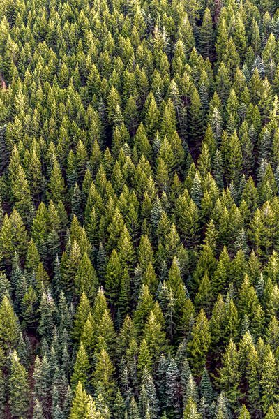

# Colorization using Optimization

This repository contains a C++ implementation of the algorithm described in 
Esfandarani, Hossein Talebi and Peyman Milanfar. “Nonlocal Image Editing.” IEEE Transactions on Image Processing 23 (2014): 4460-4473.

**Note:** This implementation can only handle images of moderate size (~O(100) x O(100)).

## Compile

### Requirements

1. [C++11/14/17](https://isocpp.org/)
1. [OpenCV](https://opencv.org/)
2. [Eigen3](https://eigen.tuxfamily.org/)
3. [CMake](https://cmake.org/) for generating Makefile.

### Compiling with CMake

This project includes a `CMakeLists.txt` to help locate the required libraries and their header files and generate the Makefile. If the above requirements are met, the following will generate the binaries `enhance` and `denoise`.

```bash
mkdir build
cd build
cmake -DCMAKE_BUILD_TYPE="Release" -DUSE_SPECTRA="ON" ..
make
```

## Run

The compiled binary is located in the `bin/` directory. It takes the following arguments

1. Input filename
2. Output filename 
3. Number of evenly sampled rows for Nystrom approximation
4. Number of evenly sampled cols for Nystrom approximation
5. hx
6. hy
7. Number of iterations to run for Sinkhorn-Knopp matrix balancing algorithm
8. Number of eigenvectors to keep for the filter
9. weight 1
10.  ...
11. weight k

Here is an example that uses 20 and 10 evenly sampled rows and cols respectively with hx set to 5000, hy set to 30, 10 iterations for Sinkhorn algorithm, 10 eigenvectors for filter, and weights 4, 6, 6, 1.05.

```bash
./enhance ../data/forest-10.bmp forest-filtered.png 20 10 5000 30 10 10 4 6 6 1.05
```

## Sample results

In the following table, the column **Parameters**  contains the arguments passed to the program (excluding input filename and output filename) to generate each result. The input and result images are all in the `data` directory and can be found by clicking on the respective images.

Original                               | Result                                     | Parameters
:-------------:                        | :-----:                                    | :---------
   |         | 20 10 500 30 40 10 2 7 5 1
       |        | 25 15 800 20 40 100 2 3 5 1
        |         | 20 10 5000 30 10 10 4 6 6 1.05
 |  | 10 20 200 30 30 10 3 10 1 1
        |         | 10 20 100 30 50 30 2 3 4 1
     |      | 10 20 1000 25 30 50 2 3 3 1
  |   | 20 10 400 30 50 20 2 2 2 1
            |          | 20 30 500 10 50 50 4 3 4 1

## Sample images

All the above sample images can be found in the `data` directory. 
The files with names matching the pattern `<name>-filtered.png` are the 
filtered results corresponding to each image.

Most of the sample images are downloaded from [pexels.com](https://www.pexels.com/search/black-and-white/).

## Limitations and possible improvements

The method described in the paper requires us to compute the eigenvectors of a `N x N` matrix, where `N` is the number of pixels in the image. It uses the Nystrom method to approximate these eigenvectors, but it is very numerically unstable - if the bandwidths, hx and hy, are not set appropriately, the resulting eigenvectors can be very bad. Furthermore, we will need to allocate memory of size `O(kN)` to store intermediate matrices. If the matrix has high rank, `k` can be fairly large, so even for modest size images the system will have trouble allocating the memory.

Some possible ways to handle these problems include finding better ways to sample the entries of the image for building the affinity matrix `Ka` and `Kab`(see paper), for e.g., the method described in Si, Si, Cho-Jui Hsieh and Inderjit S. Dhillon. “Computationally Efficient Nyström Approximation using Fast Transforms.” ICML (2016).

It is also interesting to think about whether this approach of using the eigenvectors related to the filter matrix can be "combined" with that of Local Laplacian filters as described in 
Paris, Sylvain, Samuel W. Hasinoff and Jan Kautz. “Local Laplacian filters: edge-aware image processing with a Laplacian pyramid.” ACM Trans. Graph. 30 (2011): 68:1-68:12
to produce a more efficient hybrid method.

## Copyright

This implementation is written **without** consulting the code from the authors, so there might be some differences in the final output. Please bear this in mind if you intend to use the code in this repository to generate results for comparison.

Usage of this code is free for research purposes only. Please refer to the above publication if you use the program.

This work is provided as is without any warranty.
